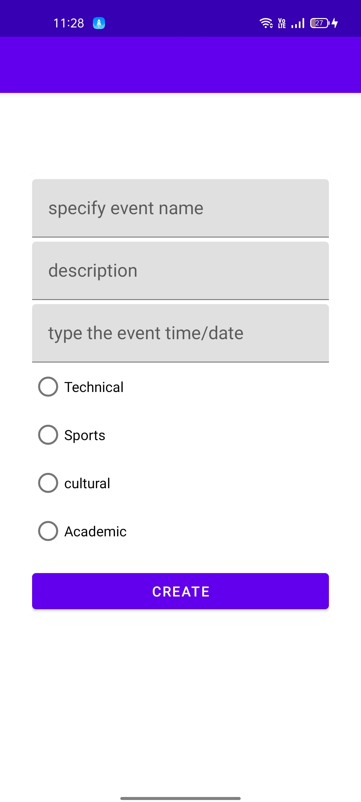

# Broadcast

## #tirutsava22_appdev

## Background

The goal of this app is to ensure that you **"Never miss anything"**

> >

1. EVENTS
2. LOST
3. FOUND

Along with these three sections it has a login system so that user can upload/announce anything.
Their account can be safely protected by their password

## About

It's a small and lightweight that allows members of a community to announce or post something to the network so that all of their peers can see and respond to it.

## EVENTS

Users can post upcoming or ongoing events in this section.

> > Uses:

We have a tendency to forget or be unaware of events that are taking place around us.
However, by using this app, you can find out about all of the activities/events that are taking place in one spot.
so that you don't have to check all of your emails!!

**"Never miss an event, and always be informed"**

## LOST/FOUND

users can post the details of any item that they lost/can post the details of items that they found in respective sections

> > Uses:

It's also a typical occurrence for us to forget or lose anything (like we keep at some place and forget to take it back with us).

In this circumstance, we usually ask everyone if they know anything about the object we've lost.
What if we had a platform where you could notify everyone in your community that you had lost something?

This can be done using this app.

> >

     After restarting the app, the newly added item will be visible.

## Features

- Splash Screen
- Easy Login System,Auto Login System
- Beautiful UI
- Multiscreen app with easy navigation
- One can add into the database easily

## Screenshots

    &emsp;
  &emsp;
  

 
 

    &emsp;
  &emsp;
  

